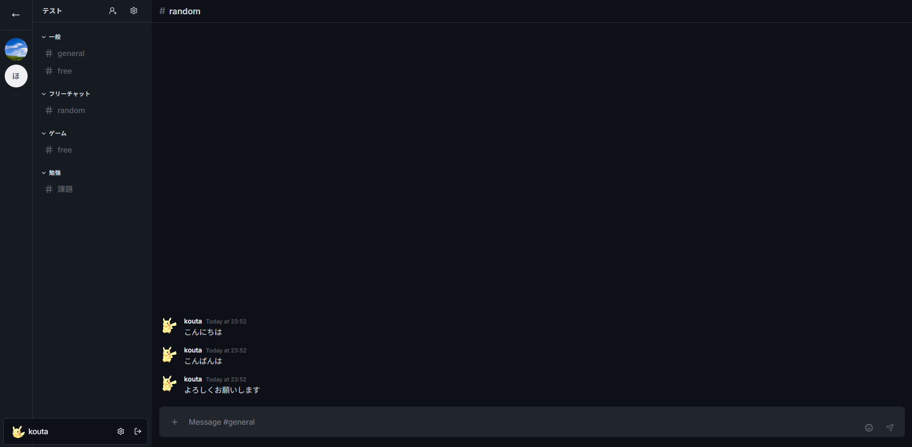

# Chat App

マイクロサービスアーキテクチャで構築されたチャットアプリケーションです。

## 主な機能

- サーバー管理: サーバー、カテゴリ、チャンネルの作成
- 認証: ユーザー登録、ログイン、JWTによる認証
- 招待システム: 招待リンクの生成と利用
- メッセージング: チャンネル内でのメッセージ送信と取得

## 技術スタック

### バックエンド

- 言語: [Go](https://go.dev/)
- フレームワーク: [chi](https://go-chi.io/#/)
- API: [gRPC](https://grpc.io/), [Protocol Buffers](https://protobuf.dev/)
- 認証: [JWT](https://jwt.io/)

### フロントエンド

- 言語: [TypeScript](https://www.typescriptlang.org/)
- フレームワーク: [React](https://react.dev/)
- APIクライアント: [Orval](https://orval.dev/)

### インフラ & データベース

- データベース: [PostgreSQL](https://www.postgresql.org/)
- DBマイグレーション: [Atlas](https://atlasgo.io/)
- クエリビルダ: [sqlc](https://sqlc.dev/)
- コンテナ: [Docker](https://www.docker.com/)

## 今後実装予定

- WebSocketを用いたリアルタイムチャット機能
- Redisを用いたキャッシュ、Pub/Sub
- 通知機能など
